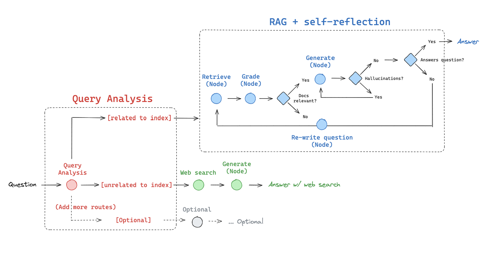

# 🔄 Corrective RAG System

<div align="center">


**A sophisticated Retrieval-Augmented Generation system with built-in self-correction, validation, and quality control**

[Features](#-features) •
[Quick Start](#-quick-start) •
[Documentation](#-documentation) •
[Contributing](#-contributing)

</div>
---
<div align="center">


</div>
---
## What Makes This RAG System Special?

Traditional RAG systems have a critical flaw: they assume retrieved documents are always relevant and generated answers are always accurate. **Corrective RAG** fixes this with multiple validation stages and automatic correction loops.

### 🎯 Key Innovations

- **🔍 Smart Query Routing**: Automatically determines whether to use your vectorstore or web search
- **📊 Document Grading**: Evaluates and filters documents for relevance before generation
- **✅ Hallucination Detection**: Validates that answers are actually grounded in retrieved facts
- **🎯 Answer Quality Check**: Ensures responses truly address the user's question
- **🔄 Self-Correction Loop**: Automatically retries or falls back to web search when quality is insufficient
- **🌐 Web Search Integration**: Seamless fallback to Tavily search for comprehensive coverage


---

##  Features

### 🖥️ Interactive Dashboard

Beautiful Streamlit interface with three main sections:

####  Query System
- 💬 **Chat-style Interface**: Natural conversation flow
- 🔄 **Real-time Processing**: See your query being processed
- 📊 **Detailed Analytics**: View document count, web search usage, and sources
- 💾 **Chat History**: Keep track of your conversation

#### Document Ingestion
- 📤 **File Upload**: Support for `.txt`, `.pdf`, `.doc`, `.docx`
- 🚀 **Batch Processing**: Upload multiple files at once
- 💫 **Progress Indicators**: Visual feedback during processing
- 🔄 **Auto-indexing**: Automatically adds documents to vectorstore

#### System Information
- 📊 **Workflow Visualization**: Generate and view your RAG pipeline diagram
- ⚙️ **System Status**: Check API keys, vectorstore, and configuration


### 🔧 Technical Stack

<div align="center">

| Component | Technology | Purpose |
|-----------|-----------|---------|
| **Orchestration** | LangGraph | Workflow management |
| **LLM Provider** | OpenAI GPT-4 | Language generation |
| **Embeddings** | OpenAI Embeddings | Document vectorization |
| **Vector Store** | ChromaDB | Document storage & retrieval |
| **Web Search** | Tavily API | External knowledge |
| **UI Framework** | Streamlit | Interactive dashboard |
| **Document Processing** | PyPDF, python-docx | File parsing |

</div>

---

## 🚀 Quick Start

### Prerequisites

- Python 3.10 or higher
- OpenAI API key 
- Tavily API key 
### Installation

**Clone the repository**
```bash
git clone https://github.com/berkerbasrgn/advancedRAG.git
cd advancedRAG
```

**Create a virtual environment**
```bash
python -m venv venv

# On macOS/Linux:
source venv/bin/activate

# On Windows:
venv\Scripts\activate
```

**Install dependencies**
```bash
pip install -r requirements.txt
```

**Configure environment variables**

Create a `.env` file in the project root:
```env
OPENAI_API_KEY=sk-proj-your-key-here
TAVILY_API_KEY=tvly-your-key-here
LANGCHAIN_API_KEY=your-langsmith-key
LANGCHAIN_TRACING_V2=true
LANGCHAIN_PROJECT=corrective-rag
```

**Launch the dashboard**
```bash
streamlit run app.py
```

**Open your browser**
```
http://localhost:8501
```

---

## 📖 Documentation

### Project Structure

```
corrective-rag/
├── app.py                    # Streamlit dashboard (main UI)
├── main.py                   # Workflow entry point
├── ingestion.py              # Document processing & vectorstore
├── requirements.txt          # Python dependencies
├── .env                      # Environment variables (create this)
│
├── graph/                       # RAG Workflow Implementation
│   ├──  graph.py             # Main workflow orchestration
│   ├──  state.py             # State definitions
│   ├──  node_constants.py    # Constants
│   │
│   ├── chains/                 # LLM Chain Components
│   │   ├── answer_grader.py   # Validates answer quality
│   │   ├── generation.py      # Generates responses
│   │   ├── hallucination_grader.py  # Detects hallucinations
│   │   ├── retrieval_grader.py     # Grades document relevance
│   │   └── router.py          # Routes queries intelligently
│   │
│   └── nodes/                  # Workflow Nodes
│       ├── generate.py         # Answer generation
│       ├── grade_documents.py  # Document filtering
│       ├── retrieve.py         # Vector retrieval
│       └── web_search.py       # Web search fallback
│
└──  graph.png                # Workflow diagram (auto-generated)
```

## 🎮 Usage Examples


### With Document Upload (via Dashboard)
1. Click on **"📚 Document Ingestion"** tab
2. Upload your documents (PDF, TXT, DOCX)
3. Click **"🚀 Process Documents"**
4. Switch to **"🔍 Query System"** and ask questions about your documents!


### Decision Points

The workflow makes intelligent decisions at each stage:

1. **Route Decision**: Vectorstore vs Web Search
2. **Grade Decision**: Keep documents or search web
3. **Generation Decision**: Accept answer or retry
4. **Quality Decision**: Return answer, regenerate, or web search

---


## 📊 Monitoring & Debugging

### Enable LangSmith Tracing

Add to your `.env`:
```env
LANGCHAIN_API_KEY=your-key
LANGCHAIN_TRACING_V2=true
LANGCHAIN_PROJECT=corrective-rag
```

View traces at: https://smith.langchain.com

## 🐛 Troubleshooting

### Common Issues

| Issue | Solution |
|-------|----------|
| **API Key Not Found** | Create `.env` file with `OPENAI_API_KEY` |
| **ChromaDB Warnings** | Add `USER_AGENT=corrective-rag/1.0` to `.env` |
| **Port Already in Use** | Use different port: `streamlit run app.py --server.port=8502` |
| **Module Not Found** | Run `pip install -r requirements.txt` |
| **Graph Won't Render** | Install Graphviz: `brew install graphviz` (macOS) |

### Get Help
1. Open an [Issue](https://github.com/berkerbasrgn/advancedRAG/issues)

---


## 🤝 Contributing

I welcome contributions.

1.  Fork the repository
2.  Create a feature branch (`git checkout -b feature/AmazingFeature`)
3.  Make your changes
4.  Run tests
5.  Commit your changes (`git commit -m 'Add AmazingFeature'`)
6.  Push to branch (`git push origin feature/AmazingFeature`)
7.  Open a Pull Request

---

## 🙏 Acknowledgments

- **LangChain Team**: For the amazing framework
- **LangGraph**: For powerful workflow orchestration
- **Streamlit**: For the beautiful UI framework
- **OpenAI**: For GPT-4 and embeddings
- **Tavily**: For web search integration
- **ChromaDB**: For efficient vector storage

---

## 📮 Contact & Support

- 📧 **Email**: bberkerbasergun@gmail.com
- 💼 **LinkedIn**: [https://www.linkedin.com/in/burakberkerbasergun/](https://www.linkedin.com/in/burakberkerbasergun/)
- 🐙 **GitHub**: [@berkerbasrgn](https://github.com/berkerbasrgn)
- 🌐 **Website**: [https://www.linkedin.com/in/burakberkerbasergun/](https://yourwebsite.com)

---

<div align="center">

### ⭐ Star this repo if you find it helpful!

**Built with ❤️ using LangChain, LangGraph, and Streamlit**

[⬆ Back to Top](#-corrective-rag-system)

</div>